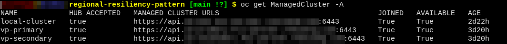
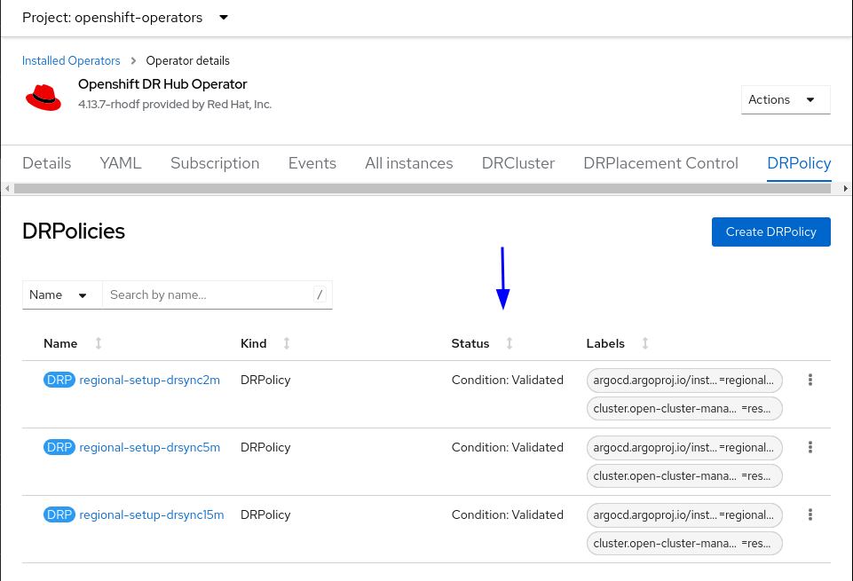

# Regional Resiliency Pattern

*Regional Resiliency Pattern* is a [Validated Pattern][vp] derived from the [Multicluster DevSevOps Pattern][devsecops].
Including the [Regional DR][regional] solution from [Red Hat OpenShift Data Foundation][odf] and the
[Regional DR Trigger Operator][rdrtrigger]. Used for automated application failover between
[Red Had Advanced Cluster Management][acm] *Managed Clusters*.

<details>
<summary>Click for operator update instructions</summary>
<p>
The <em>Regional DR Operator</em> chart is in <a href="charts/hub/rdrtrigger">charts/hub/rdrtrigger</a>. We use
[git subtree][subtree], our target is the <a href="https://github.com/RHEcosystemAppEng/regional-dr-trigger-operator-chart">original chart</a>.
We can update it using the following command:

```shell
# replace ref with the target reference
git subtree pull --prefix=charts/hub/rdrtrigger \
https://github.com/RHEcosystemAppEng/regional-dr-trigger-operator-chart.git ref --squash
```

</p>
</details>

<!--LINKS-->
[acm]: https://www.redhat.com/en/technologies/management/advanced-cluster-management
[devsecops]: https://validatedpatterns.io/patterns/devsecops/
[odf]: https://access.redhat.com/documentation/en-us/red_hat_openshift_data_foundation/4.14
[rdrtrigger]: https://github.com/RHEcosystemAppEng/regional-dr-trigger-operator-chart
[regional]: https://access.redhat.com/documentation/en-us/red_hat_openshift_data_foundation/4.14/html/configuring_openshift_data_foundation_disaster_recovery_for_openshift_workloads/rdr-solution
[subtree]: https://docs.github.com/en/get-started/using-git/about-git-subtree-merges
[vp]: https://validatedpatterns.io/


## RegionalDR instructions
This sections describes how to configure and install this pattern to deploy a
RegionalDR architecture


This Pattern has the capability to deploy several RegionalDR deployments and
orchestrate them from the same HubCluster. In addition, each RegionalDR supports
one primary cluster and several secondary clusters.

Special thanks to Gaurav Midha (gmidha1) for doing a great work on this pattern.


## Prerequisites
User must provide the following pre-requisites to use the pattern correctly
* Hub Cluster
* Primary and Secondary clusters
* Openshift Data Foundation (ODF) must be installed and configured in Primary
  and Secondary clusters. Create and configure a Storage System too on each
cluster. Remember to enable the RegionalDR feature when creating the Storage
System.
* AWS account AccessKey
* :warning: Do not configure Advance Cluster Management (ACM) by your own. Simply provision the
  infrastructure and the pattern will setup the operators and its configuration


## Installation
1. Fork and Download the pattern.
```
git clone https://github.com/<ORG>/regional-resiliency-pattern.git
cd regional-resiliency-pattern
```

2. Configure the pattern. Open the `values-global-yaml` file and edit the
   `regionalDR` structure. Use this example.
```yaml
---
regionalDR: # The RegionalDR can manage one or more different RDR deployments
  - name: <REGIONAL_DR_DEPLOYMENT_NAME> # This name will be used for naming the ManagedClusterSet and as a prefix in the rest of dependant objects
    primary:
      name: "<PRIMARY_CLUSTER_NAME>"
      region: "<PRIMARY_CLUSTER_REGION>"

    secondaries: # The pattern supports one or more Secondary clusters
      - name: "<SECONDARY_1_CLUSTER_NAME>"
        region: "<SECONDARY_1_CLUSTER_REGION>"
      - name: "<SECONDARY_2_CLUSTER_NAME>"
        region: "<SECONDARY_2_CLUSTER_REGION>"
      ...
      - name: "<SECONDARY_N_CLUSTER_NAME>"
        region: "<SECONDARY_N_CLUSTER_REGION>"

    secretStore: # References to the HashicorpVault instance included in this pattern
      name: vault-backend
      kind: ClusterSecretStore


global:
  pattern: multicluster-devsecops
...
...
```

3. Push your changes 
```sh
git add values-global.yaml
git commit -m "New RDR config"
git push
```

4. Fill your `values-secrets.yaml`. :warning: DO NOT COMMIT THIS FILE

5. Remember to install and configure ODF and a Storage System before continue
   this steps.

6. ODF will expose an S3 endpoint usign Noobaa, and it will be used as an
   exchange point of information about the apps that are being managed by the
DR Operator. To make this works correctly, the S3 point must be served by HTTPS
using a certificate signed by a well-known CA. In other words, if your Openshift
cluster still using the default self-signed certificate configured during the
clusters creation, you need to update the S3 Route and configure a trustable
certificate. :question: Let's encrypt and the acme-operator will work but are not
recomended for production environments

5. Connect `oc` CLI to the HUB cluster

6. Install the Pattern. This will install the operators, namespaces and
   applications defined on `values-hub.yaml` file. Check it to understand better
which applications are being installed.
```
# First, check the generated Pattern object
./pattern.sh make show

# If everything looks good, run the install command
./pattern.sh make install

# If you need to update a secret, do it, and run the following command to
refresh it on the pattern instance.
./pattern.sh make post-install

```
:exclamation: You might need to remove the ExternalSecrets to generate a Secret
with the updated values. Check your ExternalSecrets and its refreshing period.


7. Obtain the GitOps routes, and access them. There are two different GitOps
   servers. First, is used by the Pattern Operator to deploy our Pattern
Instance, second GitOps is part of this pattern and it installs all the
applications and objects included.
```sh
# First GitOps
oc get Route -n openshift-gitops openshift-gitops-server

# Hub's Gitops
oc get Route -n regional-resiliency-pattern-hub hub-gitops-server
```

Access first GitOps and check the Application is Healthy


8. When ACM is installed on the Hub Cluster, attach the spoke clusters (Primary
   and Secondaries) to the Hub Cluster creating the ManagedCluster objects. Use
your preferred method to attach them, but remember the pattern can't finish the
installation correctly until every cluster defined on `values-global.yaml` file
is connected to ACM.
```sh
oc get ManagedCluster -A
```

:question: *The pattern is not creating the ManagedCluster Objects. This is
because if the pattern needs to be uninstalled, it will remove the
ManagedClusters too, making the operability of the pattern harder. The current
approach is to let the user to provision the infrastructure to maintain the full
control of it on the user.*

9. Go to the Hub's Gitops, open the regional-dr Application and wait for every
   object is correctly synchronized by the GitOps server.

10. On the Hub's Gitops, open the regional-dr-trigger Application and check that
    is correctly deployed. The regional-dr-trigger will watch for the
ManagedCluster status (based on Klusterlet heartbeat), and if one of the cluster
becomes "UNKNOWN", it will consider there is a cluster issue, and trigger the
FailOver of the applications hosted on that cluster.


11. Wait for submariner to be deployed

12. Check DRPolicies on Hub Cluster and its status. DRPolicies must be Validated
    to consider that the configuration is correctly done.



## Deploy an example application
This repo includes a simple busybox application prepared to test the Regional-DR
feature.

:exclamation: Before creating the busybox app, edit the file, and replace the
values: `<PRIMARY_CLUSTER_NAME>, <SECONDARY_CLUSTER_NAME> and <DRPOLICY_NAME> on
the DRPlacementControl file by the values you defined in your deployment.
```yaml
---
apiVersion: ramendr.openshift.io/v1alpha1
kind: DRPlacementControl
metadata:
  labels:
    app: busybox
    cluster.open-cluster-management.io/backup: resource
  name: busybox-rdr
  annotations:
  namespace: busybox-rdr-test
spec:
  preferredCluster: <PRIMARY_CLUSTER_NAME>
  failoverCluster: <SECONDARY_CLUSTER_NAME>
  drPolicyRef:
    name: <DRPOLICY_NAME>
  placementRef:
    kind: PlacementRule
    name: busybox
    namespace: busybox-rdr-test
  pvcSelector: {}
```

Once is modified, apply the manifest.
```sh
oc apply -f ./doc/example-app/busybox.yaml
```

Check on ACM console the application status to confirm is correctly deployed on
the Primary Cluster

## Uninstall
Never try to delete objects manually for uninstalling the pattern. The GitOps
server will try to resync the resources, and if are not deleted in the correct
order, it could generate dangling objects and configurations that will interfere
on future deployments.

To uninstall the pattern correctly (at lease the RegionalDR part) follow this
steps:
1. Go to First GitOps console and disable the auto-sync
2. Go to Hub's GitOps console and remove the `regional-dr` Application. It could
   take several minutes. If it takes more than 10 min, check the MirrorPeer
objects on the ODF Multicluster Orchestrator Operator and look for any
finalizers that may be blocking the deletion process that may be blocking the
deletion process.
3. Once the `regional-dr` Application is correctly uninstalled, it will
   disappear from Hub's GitOps.
