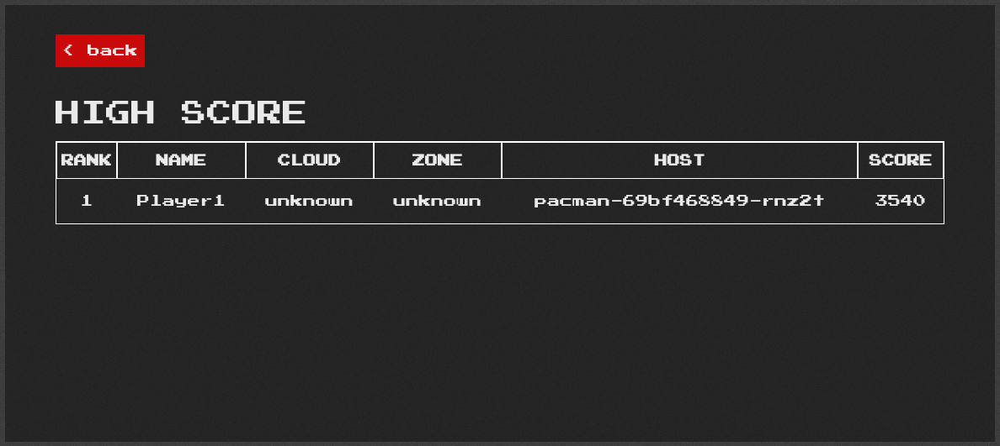
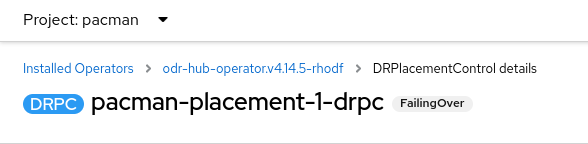
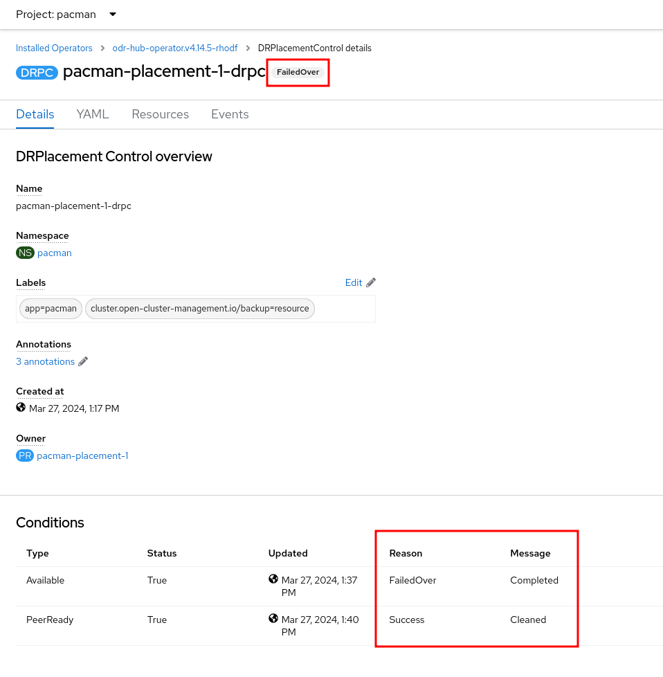
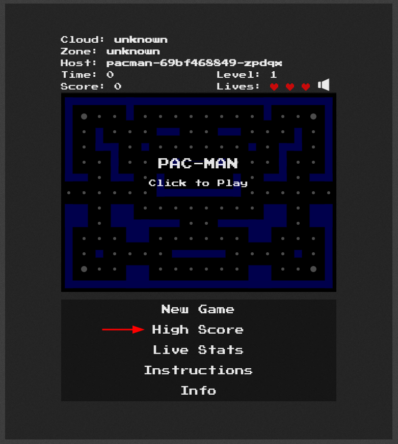

# RegionalDR Example Application
This document explains how to deploy an application for testing the RegionalDR
Pattern

The application deploys two pods (pacman-app, MongoDB). The MongoDB instance
mounts a 5GiB PVC which will be replicated between active and passive clusters.

## Deployment
1. Before creating the app, consider the changes you made in your values file, and
adapt this app for your setup. Open the `03-drpc.yaml` file and check the lines:
    ```yaml
    ---
    apiVersion: ramendr.openshift.io/v1alpha1
    kind: DRPlacementControl
    metadata:
      labels:
        app: pacman
        cluster.open-cluster-management.io/backup: resource
      name: pacman-placement-1-drpc
      annotations:
      namespace: pacman
    spec:
      preferredCluster: <YOUR_PRIMARY_CLUSTER_NAME>
      failoverCluster: <YOUR_SECONDARY_CLUSTER_NAME>
      drPolicyRef:
        name: <YOUR_DR_POLICY_NAME>
      placementRef:
        kind: PlacementRule
        name: pacman-placement-1
        namespace: pacman
      pvcSelector: {}
    ```
    :warning: If you didn't change the `values-resilient.yaml` file, you don't need
    to follow this step. The example value is already prepared to work with the
    pre-defined resilient values.


2. For deploying the Pacman app, connect your `oc` CLI to the Hub Cluster and run
the following commands:

```sh
oc apply -f ./rdr-example-app
```

## Verify App
1. Once the app is deployed, wait a few minutes and check the DRPC to check the
status of our app
```sh
oc get drpc -n pacman
# NAME                      AGE   PREFERREDCLUSTER   FAILOVERCLUSTER DESIREDSTATE   CURRENTSTATE
# pacman-placement-1-drpc   45m   ocp-primary        ocp-secondary                  Deployed
```
This can be checked also on the ACM Applications section, or in the DRHub
Operator page, and get the DRPC details:


Access the Pacman Route on the primary cluster
```sh
oc get route pacman -n pacman -o jsonpath='{.spec.host}'
```


Play until you loose, and save your record. We will use that info to demonstrate
the data was sync correctly later.




## Trigger Failover
Triggering the Failover process is so easy, just patch the DRPC object with the
following command:
```sh
oc patch drpc pacman-placement-1-drpc -n pacman --type merge -p '{"spec": {"action": "Failover"}}'
```




## Check data was migrated correctly
Access the Pacman Route on the secondary cluster
```sh
oc get route pacman -n pacman -o jsonpath='{.spec.host}'
```

On the main menu, click on "High Score", and you will see how the scores of the
Pacman game still having the same records when it was running on the Primary
cluster.



